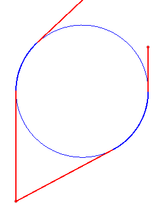
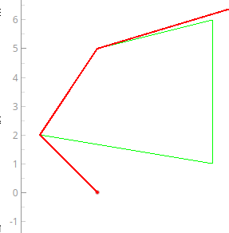

# 🚁 **Drone Trajectory Planning**


Добро пожаловать в проект **Drone Trajectory Planning**! Этот проект предназначен для построения кратчайшего маршрута для беспилотника с учетом возможных преград в виде ПВО и холмов.
## 📋 **Оглавление**

- [О проекте](#-о-проекте)
- [Возможности](#-возможности)
- [Команда](#-команда)
- [Технологии](#-технологии)
- [Установка](#-установка)
- [Использование](#-использование)
- [Примеры](#-примеры)
- [Контакты](#-контакты)
- [Requirements](#-requirements)

## 🌟 **О проекте**

> **Drone Trajectory Planning** — это проект, который решает задачу построения оптимального маршрута для беспилотника. Проект учитывает возможные преграды в виде окружностей и многоугольников, обеспечивая безопасное и эффективное движение.

### Основные задачи проекта:

- 🛰️ Построение кратчайшего маршрута.
- 🚧 Обход преград (окружностей и многоугольников).
- 🚀 Оптимизация пути с использованием алгоритма Литтла и Метода ветвей и границ.

  ## ✨ **Возможности**

- 🛠️ **Алгоритм Литтла и Метод ветвей и границ** для поиска и восстановления кратчайшего пути.
- 📐 **Геометрические расчеты** для обхода преград.
- 🖥️ **Графический интерфейс** для визуализации маршрута.
- 📊 Поддержка работы с данными в форматах CSV и JSON.

  ## 👥 **Команда**

Проект был реализован командой из трех человек:

| Имя           | Роль                                      | Контакты                          |
|---------------|-------------------------------------------|-----------------------------------|
| **Новиков Иван** | Алгоритмы (Литтла, Метод ветвей и границ)              | [GitHub](https://github.com/dalnoboy75) |
| **Большаков Матвей**    | Геометрическая часть (обход преград)       | [GitHub](https://github.com/Matvey-cmd)   |
| **Гостев Артём**    | Графический интерфейс (GUI)               | [GitHub](https://github.com/gulyonatyoma)  |


## 🛠️ **Технологии**

Проект разработан с использованием следующих технологий и библиотек:

- **PyQt5** — для создания графического интерфейса.
- **pyqtgraph** — для визуализации маршрута.
- **numpy** — для работы с матрицами и геометрическими расчетами.
- **csv, json, os, sys** — для работы с файлами и системными функциями.
- **matplotlib** — для дополнительной визуализации данных.
- [Doxygen](https://www.doxygen.nl/)

## 🚀 **Установка**

Чтобы установить проект, выполните следующие шаги:

1. Клонируйте репозиторий:

   ```bash
   git clone https://github.com/dalnoboy75/drone_trajectory_planning.git
2. Перейдите в директорию проекта:

   ```bash
   cd drone_trajectory_planning
3. Установите зависимости:

   ```bash
   pip install -r requirements.txt
4. Запустите проект

   ```bash
   python gui.py

## 🎮 **Использование**

1. Откройте приложение.
2. Загрузите данные о препятствиях (окружности, многоугольники) с помощью кнопки Open.
3. Поменяйте вручную данные в таблицах, если вам это необходимо
4. Нажмите кнопку Run, которая запустит построение оптимального маршрута для БПЛА.
5. Просмотрите оптимальный маршрут на графике.

## 📊 **Примеры**

### Пример 1: Обход окружности



### Пример 2: Обход многоугольника




## 📞 **Контакты**

Если у вас есть вопросы или предложения, свяжитесь с нами:

- GitHub: [dalnoboy75](https://github.com/dalnoboy75)
- Telegram: [dalnoboy75](https://t.me/dalnoboy75)

### 📦 **Requirements**

Для работы проекта требуются следующие библиотеки:

```plaintext
PyQt5==5.15.9
pyqtgraph==0.12.4
numpy==1.21.4
matplotlib==3.4.3
